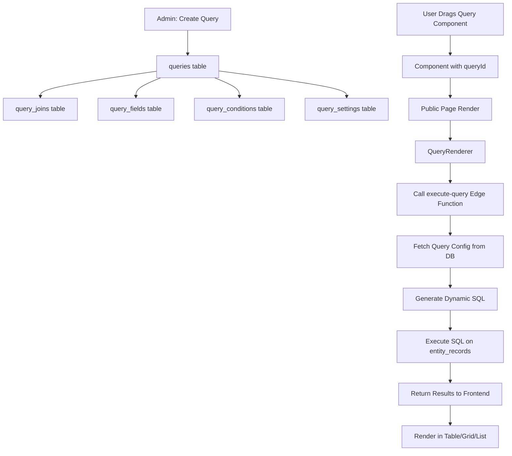

Great clarification! You're right - we should treat queries as first-class objects in the system, similar to how entities work. Let me look at the current structure to understand the pattern better.

Now let me check the App.tsx to understand the routing structure:

Perfect! Now I have a complete understanding of the structure. Let me create an updated plan that treats queries as first-class database objects like entities.

## Updated Query Component Implementation Plan

### Overview
Add a **Query Builder** system that stores queries as database objects (similar to entities) and generates dynamic SQL queries executed server-side via edge functions. Queries will support multi-entity joins, conditions, flat results, and aggregate results.

---

## 1. Database Schema Changes

### New Tables to Create

#### **`queries` table**
Stores query definitions as first-class objects.

```sql
CREATE TABLE queries (
  id UUID PRIMARY KEY DEFAULT gen_random_uuid(),
  user_id UUID NOT NULL REFERENCES auth.users(id),
  name TEXT NOT NULL, -- internal identifier (e.g., "blog_products_join")
  display_name TEXT NOT NULL, -- user-friendly name
  description TEXT,
  query_type TEXT NOT NULL CHECK (query_type IN ('flat', 'aggregate')),
  is_published BOOLEAN DEFAULT false,
  created_at TIMESTAMPTZ DEFAULT now(),
  updated_at TIMESTAMPTZ DEFAULT now()
);

-- RLS policies
ALTER TABLE queries ENABLE ROW LEVEL SECURITY;

CREATE POLICY "Users can view own queries" ON queries
  FOR SELECT USING (auth.uid() = user_id);

CREATE POLICY "Users can insert own queries" ON queries
  FOR INSERT WITH CHECK (auth.uid() = user_id);

CREATE POLICY "Users can update own queries" ON queries
  FOR UPDATE USING (auth.uid() = user_id);

CREATE POLICY "Users can delete own queries" ON queries
  FOR DELETE USING (auth.uid() = user_id);

CREATE POLICY "Users can view published queries" ON queries
  FOR SELECT USING (is_published = true);
```

#### **`query_joins` table**
Stores join relationships for each query.

```sql
CREATE TABLE query_joins (
  id UUID PRIMARY KEY DEFAULT gen_random_uuid(),
  query_id UUID NOT NULL REFERENCES queries(id) ON DELETE CASCADE,
  target_entity_id UUID NOT NULL REFERENCES entities(id),
  join_type TEXT NOT NULL CHECK (join_type IN ('inner', 'left', 'right')),
  primary_field TEXT NOT NULL, -- field name from primary entity
  target_field TEXT NOT NULL, -- field name from target entity
  position INTEGER NOT NULL DEFAULT 0,
  created_at TIMESTAMPTZ DEFAULT now()
);

-- RLS policies
ALTER TABLE query_joins ENABLE ROW LEVEL SECURITY;

CREATE POLICY "Users can manage joins of own queries" ON query_joins
  FOR ALL USING (
    EXISTS (
      SELECT 1 FROM queries 
      WHERE queries.id = query_joins.query_id 
      AND queries.user_id = auth.uid()
    )
  );

CREATE POLICY "Users can view joins of published queries" ON query_joins
  FOR SELECT USING (
    EXISTS (
      SELECT 1 FROM queries 
      WHERE queries.id = query_joins.query_id 
      AND queries.is_published = true
    )
  );
```

#### **`query_fields` table**
Stores selected fields for each query.

```sql
CREATE TABLE query_fields (
  id UUID PRIMARY KEY DEFAULT gen_random_uuid(),
  query_id UUID NOT NULL REFERENCES queries(id) ON DELETE CASCADE,
  entity_id UUID NOT NULL REFERENCES entities(id),
  field_name TEXT NOT NULL,
  aggregation TEXT CHECK (aggregation IN ('count', 'sum', 'avg', 'min', 'max')), -- for aggregate queries
  position INTEGER NOT NULL DEFAULT 0,
  created_at TIMESTAMPTZ DEFAULT now()
);

-- RLS policies
ALTER TABLE query_fields ENABLE ROW LEVEL SECURITY;

CREATE POLICY "Users can manage fields of own queries" ON query_fields
  FOR ALL USING (
    EXISTS (
      SELECT 1 FROM queries 
      WHERE queries.id = query_fields.query_id 
      AND queries.user_id = auth.uid()
    )
  );

CREATE POLICY "Users can view fields of published queries" ON query_fields
  FOR SELECT USING (
    EXISTS (
      SELECT 1 FROM queries 
      WHERE queries.id = query_fields.query_id 
      AND queries.is_published = true
    )
  );
```

#### **`query_conditions` table**
Stores filter conditions for each query.

```sql
CREATE TABLE query_conditions (
  id UUID PRIMARY KEY DEFAULT gen_random_uuid(),
  query_id UUID NOT NULL REFERENCES queries(id) ON DELETE CASCADE,
  entity_id UUID NOT NULL REFERENCES entities(id),
  field_name TEXT NOT NULL,
  operator TEXT NOT NULL CHECK (operator IN ('equals', 'not_equals', 'contains', 'gt', 'lt', 'gte', 'lte', 'is_empty', 'is_not_empty')),
  value TEXT,
  logic TEXT NOT NULL DEFAULT 'and' CHECK (logic IN ('and', 'or')),
  position INTEGER NOT NULL DEFAULT 0,
  created_at TIMESTAMPTZ DEFAULT now()
);

-- RLS policies
ALTER TABLE query_conditions ENABLE ROW LEVEL SECURITY;

CREATE POLICY "Users can manage conditions of own queries" ON query_conditions
  FOR ALL USING (
    EXISTS (
      SELECT 1 FROM queries 
      WHERE queries.id = query_conditions.query_id 
      AND queries.user_id = auth.uid()
    )
  );

CREATE POLICY "Users can view conditions of published queries" ON query_conditions
  FOR SELECT USING (
    EXISTS (
      SELECT 1 FROM queries 
      WHERE queries.id = query_conditions.query_id 
      AND queries.is_published = true
    )
  );
```

#### **`query_settings` table**
Stores query execution settings (primary entity, grouping, sorting, display options).

```sql
CREATE TABLE query_settings (
  id UUID PRIMARY KEY DEFAULT gen_random_uuid(),
  query_id UUID NOT NULL REFERENCES queries(id) ON DELETE CASCADE UNIQUE,
  primary_entity_id UUID NOT NULL REFERENCES entities(id),
  group_by JSONB DEFAULT '[]'::jsonb, -- array of field names for aggregate queries
  sort_entity_id UUID REFERENCES entities(id),
  sort_field TEXT,
  sort_order TEXT CHECK (sort_order IN ('asc', 'desc')),
  limit_rows INTEGER DEFAULT 50 CHECK (limit_rows > 0 AND limit_rows <= 500),
  display_style TEXT DEFAULT 'table' CHECK (display_style IN ('table', 'grid', 'list')),
  show_row_numbers BOOLEAN DEFAULT false,
  created_at TIMESTAMPTZ DEFAULT now(),
  updated_at TIMESTAMPTZ DEFAULT now()
);

-- RLS policies
ALTER TABLE query_settings ENABLE ROW LEVEL SECURITY;

CREATE POLICY "Users can manage settings of own queries" ON query_settings
  FOR ALL USING (
    EXISTS (
      SELECT 1 FROM queries 
      WHERE queries.id = query_settings.query_id 
      AND queries.user_id = auth.uid()
    )
  );

CREATE POLICY "Users can view settings of published queries" ON query_settings
  FOR SELECT USING (
    EXISTS (
      SELECT 1 FROM queries 
      WHERE queries.id = query_settings.query_id 
      AND queries.is_published = true
    )
  );
```

---

## 2. Edge Function: `execute-query`

Create a new edge function that dynamically generates and executes SQL queries based on the query configuration stored in the database.

**File:** `supabase/functions/execute-query/index.ts`

### Key Responsibilities:
1. **Fetch query configuration** from `queries`, `query_joins`, `query_fields`, `query_conditions`, `query_settings` tables
2. **Validate permissions**: Ensure user can access the query (own or published)
3. **Build dynamic SQL query**:
   - Generate JOIN clauses from `query_joins`
   - Generate SELECT clause from `query_fields` (with aggregations for aggregate queries)
   - Generate WHERE clause from `query_conditions`
   - Generate GROUP BY clause from `query_settings.group_by` (for aggregate queries)
   - Generate ORDER BY and LIMIT clauses from `query_settings`
4. **Execute SQL query** using Supabase client with proper RLS context
5. **Return results** as JSON array

### Input Parameters:
```typescript
{
  queryId: string, // UUID of the query to execute
}
```

### Output:
```typescript
{
  success: boolean,
  data: Array>, // query results
  rowCount: number,
  error?: string
}
```

### SQL Generation Logic:

**For Flat Queries:**
```sql
SELECT 
  e1.data->>'field1' AS "Entity1: Field1",
  e2.data->>'field2' AS "Entity2: Field2"
FROM entity_records e1
INNER JOIN entity_records e2 ON e1.data->>'join_field' = e2.data->>'join_field'
WHERE e1.entity_id = ''
  AND e2.entity_id = ''
  AND e1.is_published = true
  AND e2.is_published = true
  AND e1.data->>'some_field' = 'some_value'
ORDER BY e1.data->>'sort_field' ASC
LIMIT 50
```

**For Aggregate Queries:**
```sql
SELECT 
  e1.data->>'group_field' AS "Entity1: Group Field",
  COUNT(*) AS "Count",
  AVG((e1.data->>'numeric_field')::numeric) AS "Average"
FROM entity_records e1
WHERE e1.entity_id = ''
  AND e1.is_published = true
GROUP BY e1.data->>'group_field'
ORDER BY COUNT(*) DESC
LIMIT 50
```

---

## 3. Admin UI for Query Management

### A. New Admin Page: **`Queries`** (`src/pages/Queries.tsx`)

Similar to `Entities.tsx`, this page will:
- Display a grid of query cards
- Show query name, description, type (flat/aggregate), published status
- Provide buttons to: **View Results**, **Edit**, **Delete**
- Include a "New Query" button to create queries
- Navigate to `/admin/queries/:queryId/editor` for editing
- Navigate to `/admin/queries/:queryId/results` to view results

### B. New Page: **`QueryEditor`** (`src/pages/QueryEditor.tsx`)

Similar to `EntityEditor.tsx`, this page will allow users to:
- Edit query name, display name, description, published status
- Configure query type (flat/aggregate)
- Add/edit/delete joins
- Add/edit/delete fields
- Add/edit/delete conditions
- Configure settings (primary entity, grouping, sorting, display options)

### C. New Component: **`CreateQueryDialog`** (`src/components/queries/CreateQueryDialog.tsx`)

Dialog to create a new query with:
- Query name (auto-generated from display name)
- Display name
- Description
- Query type (flat/aggregate)

### D. New Page: **`QueryResults`** (`src/pages/QueryResults.tsx`)

Display the results of a query by calling the `execute-query` edge function and rendering the data in a table/grid/list based on display settings.

---

## 4. Query Component for Editors

### A. New Component Type: **"query"**

Add to `ComponentsSidebar.tsx` in the "Database" section alongside "Entity List" and "Entity Detail".

### B. New Editor: **`QueryComponentEditor.tsx`** (`src/components/editor/QueryComponentEditor.tsx`)

Dropdown to select a published query from the `queries` table. Stores `queryId` in `component.content`.

### C. Query Renderer: **`QueryRenderer`** in `ComponentRenderer.tsx`

Fetches query results by calling the `execute-query` edge function with the `queryId` from `component.content`, then renders the results based on `query_settings.display_style`.

---

## 5. Component Integration

### Files to Update:

1. **`src/components/editor/ComponentsSidebar.tsx`**
   - Add "Query" component to Database section with `DatabaseIcon`

2. **`src/components/editor/DraggableComponent.tsx`**
   - Add case for "query" component type → render `QueryComponentEditor`

3. **`src/components/public/ComponentRenderer.tsx`**
   - Add case for "query" component type → render `QueryRenderer`

4. **`src/pages/PageEditor.tsx`**
   - Add default content for "query" in `getDefaultContent()`: `{ queryId: "" }`

5. **`src/pages/WidgetEditor.tsx`**
   - Same as PageEditor

6. **`src/pages/LayoutEditor.tsx`**
   - Same as PageEditor

7. **`src/components/admin/AdminLayout.tsx`**
   - Add "Queries" section to sidebar (like Entities)
   - Add realtime subscription for `queries` table
   - Add navigation link to `/admin/queries`
   - Display list of queries with preview/delete buttons

8. **`src/App.tsx`**
   - Add routes:
     - `/admin/queries` → `Queries` page
     - `/admin/queries/:queryId/editor` → `QueryEditor` page
     - `/admin/queries/:queryId/results` → `QueryResults` page

---

## 6. Query Builder UI Components

### A. **`QueryJoinBuilder.tsx`** (`src/components/queries/QueryJoinBuilder.tsx`)

Allows users to add/edit/delete joins with:
- Target entity dropdown
- Join type selector (INNER, LEFT, RIGHT)
- Primary field dropdown
- Target field dropdown
- Delete button

### B. **`QueryFieldSelector.tsx`** (`src/components/queries/QueryFieldSelector.tsx`)

Allows users to select fields with:
- Checkboxes for fields from primary and joined entities
- Entity name prefix for clarity
- Aggregation function dropdown (for aggregate queries)
- Drag-to-reorder

### C. **`QueryConditionBuilder.tsx`** (`src/components/queries/QueryConditionBuilder.tsx`)

Allows users to add/edit/delete conditions with:
- Entity + Field dropdown
- Operator dropdown
- Value input
- AND/OR logic selector
- Delete button

### D. **`QuerySettingsPanel.tsx`** (`src/components/queries/QuerySettingsPanel.tsx`)

Allows users to configure:
- Primary entity dropdown
- Group By field checkboxes (for aggregate queries)
- Sort field dropdown
- Sort order (ASC/DESC)
- Limit input
- Display style selector (table/grid/list)
- Show row numbers checkbox

---

## 7. Data Flow Architecture



---

## 8. Security Considerations

1. **Edge Function Validation:**
   - Verify user has access to query (owns it or it's published)
   - Validate all SQL inputs to prevent injection
   - Use parameterized queries where possible
   - Enforce row limits (max 500)

2. **RLS Policies:**
   - All query-related tables have proper RLS
   - Only fetch published entity records in generated SQL
   - Respect entity-level RLS policies

3. **Performance:**
   - Add database indexes on `entity_records.entity_id` and `entity_records.data` (JSONB GIN index)
   - Cache query configuration in edge function
   - Consider pagination for large result sets

---

## 9. Files to Create

### New Files:
1. `supabase/functions/execute-query/index.ts` (edge function)
2. `src/pages/Queries.tsx` (query list page)
3. `src/pages/QueryEditor.tsx` (query editor page)
4. `src/pages/QueryResults.tsx` (query results page)
5. `src/components/queries/CreateQueryDialog.tsx`
6. `src/components/queries/QueryJoinBuilder.tsx`
7. `src/components/queries/QueryFieldSelector.tsx`
8. `src/components/queries/QueryConditionBuilder.tsx`
9. `src/components/queries/QuerySettingsPanel.tsx`
10. `src/components/editor/QueryComponentEditor.tsx`

### Modified Files:
1. `src/components/editor/ComponentsSidebar.tsx`
2. `src/components/editor/DraggableComponent.tsx`
3. `src/components/public/ComponentRenderer.tsx`
4. `src/pages/PageEditor.tsx`
5. `src/pages/WidgetEditor.tsx`
6. `src/pages/LayoutEditor.tsx`
7. `src/components/admin/AdminLayout.tsx`
8. `src/App.tsx`

---

## 10. Testing Plan

1. Create a flat query joining Blog Posts and Products
2. Create an aggregate query with COUNT and grouping
3. Test all join types (INNER, LEFT, RIGHT)
4. Test multiple conditions with AND/OR logic
5. Test sorting and limiting
6. Test all display styles (table, grid, list)
7. Test query component in page editor
8. Test permissions (own vs published queries)
9. Test performance with large datasets
10. Verify SQL injection prevention

---

## 11. Future Enhancements

- Query templates (save common query patterns)
- Query versioning and history
- Visual query relationship diagram
- Export results to CSV
- Query performance metrics
- Real-time query results with Supabase Realtime
- Query scheduling (run queries on schedule)
- Query caching for better performance

Implement the plan
