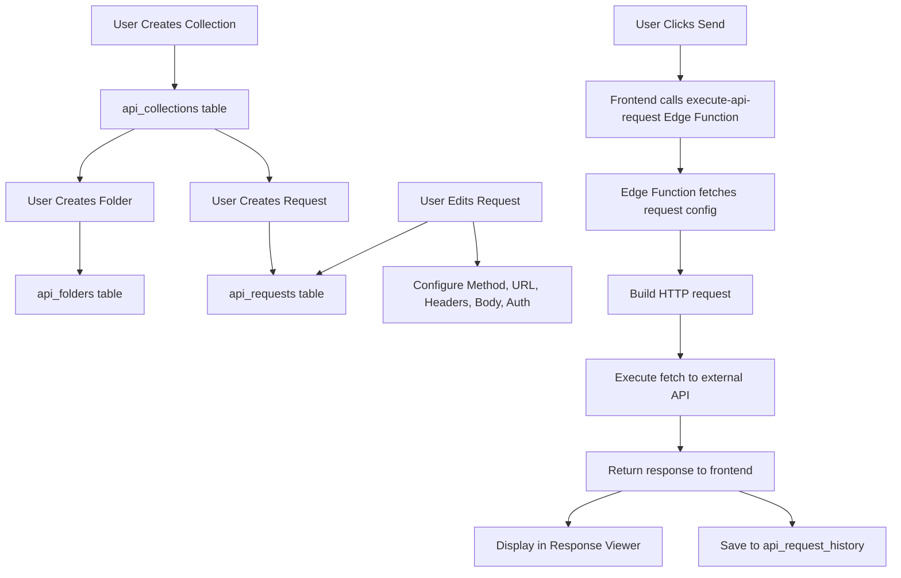

I'll analyze your request and examine the current codebase to create a comprehensive plan for adding a REST API client section.

Let me check a few more files to understand the complete pattern:

Perfect! Now I have a complete understanding of the structure. Let me create a comprehensive plan for adding a REST API client section with Postman-like UI/UX.

## REST API Client Implementation Plan

### Overview
Add a **REST API Client** section to the admin panel with a Postman-like interface. Users can organize API endpoints into collections with folder structures, test endpoints, save requests, import/export collections, and manage API configurations.

---

## 1. Database Schema

### New Tables

#### **`api_collections` table**
Stores API collections (similar to Postman collections).

```sql
CREATE TABLE api_collections (
  id UUID PRIMARY KEY DEFAULT gen_random_uuid(),
  user_id UUID NOT NULL,
  name TEXT NOT NULL,
  description TEXT,
  base_url TEXT, -- optional default base URL for all requests in collection
  is_published BOOLEAN DEFAULT false,
  created_at TIMESTAMPTZ DEFAULT now(),
  updated_at TIMESTAMPTZ DEFAULT now()
);

-- RLS policies
ALTER TABLE api_collections ENABLE ROW LEVEL SECURITY;

CREATE POLICY "Users can manage own collections" ON api_collections
  FOR ALL USING (auth.uid() = user_id);

CREATE POLICY "Users can view published collections" ON api_collections
  FOR SELECT USING (is_published = true);
```

#### **`api_folders` table**
Stores folders within collections for organizing requests.

```sql
CREATE TABLE api_folders (
  id UUID PRIMARY KEY DEFAULT gen_random_uuid(),
  collection_id UUID NOT NULL REFERENCES api_collections(id) ON DELETE CASCADE,
  parent_folder_id UUID REFERENCES api_folders(id) ON DELETE CASCADE, -- for nested folders
  name TEXT NOT NULL,
  description TEXT,
  position INTEGER NOT NULL DEFAULT 0,
  created_at TIMESTAMPTZ DEFAULT now()
);

-- RLS policies
ALTER TABLE api_folders ENABLE ROW LEVEL SECURITY;

CREATE POLICY "Users can manage folders of own collections" ON api_folders
  FOR ALL USING (
    EXISTS (
      SELECT 1 FROM api_collections 
      WHERE api_collections.id = api_folders.collection_id 
      AND api_collections.user_id = auth.uid()
    )
  );

CREATE POLICY "Users can view folders of published collections" ON api_folders
  FOR SELECT USING (
    EXISTS (
      SELECT 1 FROM api_collections 
      WHERE api_collections.id = api_folders.collection_id 
      AND api_collections.is_published = true
    )
  );
```

#### **`api_requests` table**
Stores individual API requests with configuration.

```sql
CREATE TABLE api_requests (
  id UUID PRIMARY KEY DEFAULT gen_random_uuid(),
  collection_id UUID NOT NULL REFERENCES api_collections(id) ON DELETE CASCADE,
  folder_id UUID REFERENCES api_folders(id) ON DELETE SET NULL,
  name TEXT NOT NULL,
  description TEXT,
  method TEXT NOT NULL CHECK (method IN ('GET', 'POST', 'PUT', 'PATCH', 'DELETE', 'HEAD', 'OPTIONS')),
  url TEXT NOT NULL,
  headers JSONB DEFAULT '[]'::jsonb, -- [{key: string, value: string, enabled: boolean}]
  query_params JSONB DEFAULT '[]'::jsonb, -- [{key: string, value: string, enabled: boolean}]
  body_type TEXT CHECK (body_type IN ('none', 'json', 'form-data', 'x-www-form-urlencoded', 'raw', 'binary')),
  body_content TEXT, -- JSON string or raw content
  auth_type TEXT CHECK (auth_type IN ('none', 'bearer', 'basic', 'api-key')),
  auth_config JSONB DEFAULT '{}'::jsonb, -- {token: string, username: string, password: string, key: string, value: string}
  position INTEGER NOT NULL DEFAULT 0,
  created_at TIMESTAMPTZ DEFAULT now(),
  updated_at TIMESTAMPTZ DEFAULT now()
);

-- RLS policies
ALTER TABLE api_requests ENABLE ROW LEVEL SECURITY;

CREATE POLICY "Users can manage requests of own collections" ON api_requests
  FOR ALL USING (
    EXISTS (
      SELECT 1 FROM api_collections 
      WHERE api_collections.id = api_requests.collection_id 
      AND api_collections.user_id = auth.uid()
    )
  );

CREATE POLICY "Users can view requests of published collections" ON api_requests
  FOR SELECT USING (
    EXISTS (
      SELECT 1 FROM api_collections 
      WHERE api_collections.id = api_requests.collection_id 
      AND api_collections.is_published = true
    )
  );
```

#### **`api_request_history` table**
Stores execution history for each request (optional, for history tracking).

```sql
CREATE TABLE api_request_history (
  id UUID PRIMARY KEY DEFAULT gen_random_uuid(),
  request_id UUID NOT NULL REFERENCES api_requests(id) ON DELETE CASCADE,
  status_code INTEGER,
  response_time_ms INTEGER,
  response_body TEXT,
  response_headers JSONB,
  error_message TEXT,
  executed_at TIMESTAMPTZ DEFAULT now()
);

-- RLS policies
ALTER TABLE api_request_history ENABLE ROW LEVEL SECURITY;

CREATE POLICY "Users can view history of own requests" ON api_request_history
  FOR SELECT USING (
    EXISTS (
      SELECT 1 FROM api_requests
      JOIN api_collections ON api_collections.id = api_requests.collection_id
      WHERE api_requests.id = api_request_history.request_id 
      AND api_collections.user_id = auth.uid()
    )
  );
```

---

## 2. Edge Function: `execute-api-request`

Create an edge function to execute API requests server-side (to handle CORS and secure credentials).

**File:** `supabase/functions/execute-api-request/index.ts`

### Responsibilities:
1. Fetch request configuration from database
2. Validate user permissions
3. Build HTTP request with headers, query params, body, auth
4. Execute request using `fetch`
5. Return response (status, headers, body, timing)
6. Optionally save to history

### Input:
```typescript
{
  requestId: string,
  overrides?: {
    url?: string,
    method?: string,
    headers?: Record,
    body?: any,
  }
}
```

### Output:
```typescript
{
  success: boolean,
  statusCode: number,
  statusText: string,
  headers: Record,
  body: any,
  responseTime: number,
  error?: string,
}
```

---

## 3. Admin UI Structure

### A. New Admin Page: **`ApiCollections`** (`src/pages/ApiCollections.tsx`)

**Similar to:** `Entities.tsx`

**Features:**
- Grid of collection cards
- Show collection name, description, request count
- Buttons: **View**, **Edit**, **Delete**, **Export**
- "New Collection" button
- "Import Collection" button (JSON import)

**Routes:**
- List: `/admin/api-collections`
- Editor: `/admin/api-collections/:collectionId/editor`

---

### B. New Page: **`ApiCollectionEditor`** (`src/pages/ApiCollectionEditor.tsx`)

**Similar to:** `EntityEditor.tsx` + Postman layout

**Layout:**
- **Left Sidebar (30%):** 
  - Collection name at top
  - Tree view of folders and requests
  - Drag-to-reorder support
  - Right-click context menu (New Folder, New Request, Delete, Duplicate)
  - Expand/collapse folders

- **Main Panel (70%):**
  - **Request Editor** (when request selected):
    - Top bar: Method dropdown + URL input + Send button
    - Tabs: Params, Headers, Body, Auth, Tests (future), Pre-request (future)
    - **Params Tab:** Key-value pairs for query params with enable/disable checkboxes
    - **Headers Tab:** Key-value pairs for headers with enable/disable checkboxes
    - **Body Tab:** Body type selector + content editor (JSON with syntax highlighting, Form data, Raw, etc.)
    - **Auth Tab:** Auth type selector (None, Bearer Token, Basic Auth, API Key) + config fields
  - **Response Panel** (below request editor, collapsible):
    - Status code badge (color-coded: green=2xx, yellow=3xx, red=4xx/5xx)
    - Response time
    - Tabs: Body, Headers, Cookies (future)
    - **Body Tab:** JSON pretty-print with syntax highlighting, raw view
    - **Headers Tab:** Display response headers
    - Copy response button
  - **Empty State** (when no request selected):
    - Message: "Select a request from the sidebar or create a new one"

---

### C. New Components

#### **`CreateCollectionDialog.tsx`** (`src/components/api/CreateCollectionDialog.tsx`)
Dialog to create new collection with name, description, base URL.

#### **`ImportCollectionDialog.tsx`** (`src/components/api/ImportCollectionDialog.tsx`)
Dialog to import Postman JSON collections (parse JSON and create records).

#### **`ApiRequestTree.tsx`** (`src/components/api/ApiRequestTree.tsx`)
Tree component showing folders and requests with drag-drop, expand/collapse.

#### **`ApiRequestEditor.tsx`** (`src/components/api/ApiRequestEditor.tsx`)
Main request editor with tabs (Params, Headers, Body, Auth).

#### **`ApiResponseViewer.tsx`** (`src/components/api/ApiResponseViewer.tsx`)
Response viewer with tabs (Body, Headers) and syntax highlighting.

#### **`KeyValueEditor.tsx`** (`src/components/api/KeyValueEditor.tsx`)
Reusable component for editing key-value pairs (headers, params) with enable/disable checkboxes.

#### **`ApiAuthEditor.tsx`** (`src/components/api/ApiAuthEditor.tsx`)
Auth configuration editor (Bearer, Basic, API Key).

---

## 4. Integration with AdminLayout

### Update `src/components/admin/AdminLayout.tsx`

Add new section:
```tsx
{
  name: 'API Client',
  icon: ,
  path: '/admin/api-collections',
  expanded: expandedSections.apiCollections,
  items: collections, // from state
  onToggle: () => toggleSection('apiCollections'),
  onCreate: () => navigate('/admin/api-collections'),
  onItemClick: (id) => navigate(`/admin/api-collections/${id}/editor`),
}
```

### Update Realtime Subscriptions
Add subscription for `api_collections` table to sync changes.

---

## 5. Routes to Add

**In `src/App.tsx`:**
```tsx
} />
} />
```

---

## 6. Features Breakdown

### Phase 1: Core Functionality
- Create/edit/delete collections
- Create/edit/delete folders (flat structure)
- Create/edit/delete requests
- Request editor (method, URL, headers, query params)
- Execute requests via edge function
- Display responses (status, body, headers)
- Basic auth (Bearer token)

### Phase 2: Advanced Features
- Nested folders (parent_folder_id support)
- Drag-drop reordering
- Body types (JSON, Form data, Raw, Binary)
- Multiple auth types (Basic, API Key)
- Request history
- Export collection as JSON
- Import Postman collections

### Phase 3: Power Features
- Environment variables ({{variable}} syntax)
- Pre-request scripts
- Tests/assertions
- Mock servers
- Request chaining (use response from one request in another)
- Code generation (cURL, JavaScript, Python, etc.)
- Collaboration (share collections)

---

## 7. UI/UX Considerations

### Postman-like Design Elements

1. **Method Badge Colors:**
   - GET: Blue
   - POST: Green
   - PUT: Orange
   - PATCH: Yellow
   - DELETE: Red
   - HEAD/OPTIONS: Gray

2. **Status Code Colors:**
   - 2xx: Green
   - 3xx: Yellow
   - 4xx/5xx: Red

3. **Tree View:**
   - Folders with folder icon
   - Requests with method badge
   - Expand/collapse animations
   - Hover actions (edit, duplicate, delete)

4. **Split Panel:**
   - Request editor on top (60%)
   - Response viewer on bottom (40%)
   - Resizable divider

5. **Tabs:**
   - Use Radix Tabs component
   - Underline style for active tab

6. **Syntax Highlighting:**
   - Use CodeMirror or Monaco Editor for JSON/code editing
   - Pretty-print JSON responses

---

## 8. Security Considerations

1. **Edge Function:**
   - Validate user owns the request before executing
   - Sanitize inputs to prevent injection
   - Rate limiting (max 100 requests per minute per user)
   - Timeout requests after 30 seconds
   - Log all executions for audit

2. **Credentials Storage:**
   - Encrypt sensitive auth tokens using Supabase Vault (future)
   - Never expose credentials in frontend
   - Use secrets management for API keys

3. **CORS Handling:**
   - Edge function acts as proxy to bypass CORS
   - Warning: User is responsible for respecting API terms

---

## 9. Files to Create

### Database Migration:
- Migration SQL file with all tables

### Edge Functions:
1. `supabase/functions/execute-api-request/index.ts`

### Pages:
1. `src/pages/ApiCollections.tsx`
2. `src/pages/ApiCollectionEditor.tsx`

### Components:
1. `src/components/api/CreateCollectionDialog.tsx`
2. `src/components/api/ImportCollectionDialog.tsx`
3. `src/components/api/ApiRequestTree.tsx`
4. `src/components/api/ApiRequestEditor.tsx`
5. `src/components/api/ApiResponseViewer.tsx`
6. `src/components/api/KeyValueEditor.tsx`
7. `src/components/api/ApiAuthEditor.tsx`

### Modified Files:
1. `src/components/admin/AdminLayout.tsx` (add API Client section)
2. `src/App.tsx` (add routes)

---

## 10. Data Flow



---

## 11. Import/Export Format

**Postman Collection JSON (simplified):**
```json
{
  "info": {
    "name": "My API",
    "description": "API collection"
  },
  "item": [
    {
      "name": "Get Users",
      "request": {
        "method": "GET",
        "url": "https://api.example.com/users",
        "header": [
          {"key": "Authorization", "value": "Bearer token"}
        ]
      }
    },
    {
      "name": "Auth Folder",
      "item": [
        {
          "name": "Login",
          "request": {
            "method": "POST",
            "url": "https://api.example.com/login",
            "body": {
              "mode": "raw",
              "raw": "{\"email\":\"test@example.com\"}"
            }
          }
        }
      ]
    }
  ]
}
```

**Import Logic:**
- Parse JSON
- Create collection record
- Iterate through items (folders and requests)
- Create folder/request records with proper relationships
- Show success message with count

---

## 12. Testing Plan

1. Create collection with name and base URL
2. Add folder to collection
3. Add GET request to folder
4. Configure query params and headers
5. Execute request and verify response display
6. Add POST request with JSON body
7. Test Bearer token auth
8. Export collection as JSON
9. Import exported collection
10. Test request history
11. Test delete (cascade deletion)
12. Test realtime sync between tabs

---

## 13. Future Enhancements

- WebSocket support for real-time APIs
- GraphQL query builder
- API documentation generation
- Mock server creation
- Team collaboration with shared collections
- Request runner (run multiple requests in sequence)
- Performance testing (load testing)
- API monitoring and alerting
- Generated client SDKs
- Integration with CI/CD pipelines

Implement the REST API Client plan
