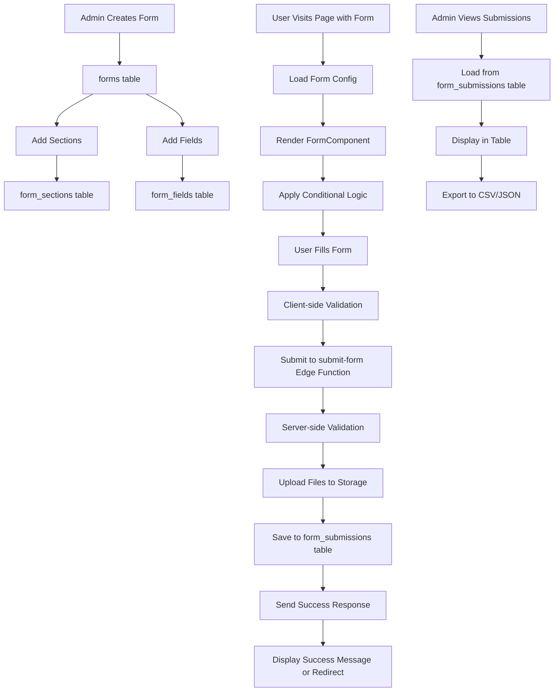

Perfect! Thank you for the detailed answers. Let me examine some additional files to understand the current patterns and then create a comprehensive implementation plan.

Perfect! Now I have a complete understanding of the codebase. Let me create a comprehensive implementation plan for the Dynamic Form Builder.

# Dynamic Form Builder Implementation Plan

## Overview
Create a comprehensive drag-and-drop form builder with support for all input field types, validation, conditional logic, multi-step forms, field grouping (sections/tabs/columns), and form submissions. Forms can be created in admin and embedded on published pages.

---

## 1. Database Schema

### New Tables

#### **`forms` table**
```sql
CREATE TABLE forms (
  id UUID PRIMARY KEY DEFAULT gen_random_uuid(),
  user_id UUID NOT NULL REFERENCES auth.users(id) ON DELETE CASCADE,
  name TEXT NOT NULL,
  title TEXT NOT NULL,
  description TEXT,
  is_published BOOLEAN DEFAULT false,
  submit_button_text TEXT DEFAULT 'Submit',
  success_message TEXT DEFAULT 'Thank you for your submission!',
  redirect_url TEXT, -- optional redirect after submission
  allow_multiple_submissions BOOLEAN DEFAULT true,
  require_authentication BOOLEAN DEFAULT false, -- if true, users must be logged in
  created_at TIMESTAMPTZ DEFAULT now(),
  updated_at TIMESTAMPTZ DEFAULT now()
);

-- RLS Policies
ALTER TABLE forms ENABLE ROW LEVEL SECURITY;

CREATE POLICY "Users can manage own forms" ON forms
  FOR ALL USING (auth.uid() = user_id);

CREATE POLICY "Public can view published forms" ON forms
  FOR SELECT USING (is_published = true);
```

#### **`form_sections` table**
For grouping fields into sections, tabs, or columns.

```sql
CREATE TABLE form_sections (
  id UUID PRIMARY KEY DEFAULT gen_random_uuid(),
  form_id UUID NOT NULL REFERENCES forms(id) ON DELETE CASCADE,
  parent_section_id UUID REFERENCES form_sections(id) ON DELETE CASCADE, -- for nested sections
  name TEXT NOT NULL,
  title TEXT NOT NULL,
  description TEXT,
  section_type TEXT NOT NULL CHECK (section_type IN ('section', 'tab', 'column', 'repeatable')),
  position INTEGER NOT NULL DEFAULT 0,
  is_visible BOOLEAN DEFAULT true,
  conditional_logic JSONB DEFAULT '{}'::jsonb, -- {field_id, operator, value} to show/hide section
  created_at TIMESTAMPTZ DEFAULT now()
);

-- RLS Policies
ALTER TABLE form_sections ENABLE ROW LEVEL SECURITY;

CREATE POLICY "Users can manage sections of own forms" ON form_sections
  FOR ALL USING (
    EXISTS (
      SELECT 1 FROM forms 
      WHERE forms.id = form_sections.form_id 
      AND forms.user_id = auth.uid()
    )
  );

CREATE POLICY "Public can view sections of published forms" ON form_sections
  FOR SELECT USING (
    EXISTS (
      SELECT 1 FROM forms 
      WHERE forms.id = form_sections.form_id 
      AND forms.is_published = true
    )
  );
```

#### **`form_fields` table**
Individual form fields with all properties.

```sql
CREATE TABLE form_fields (
  id UUID PRIMARY KEY DEFAULT gen_random_uuid(),
  form_id UUID NOT NULL REFERENCES forms(id) ON DELETE CASCADE,
  section_id UUID REFERENCES form_sections(id) ON DELETE SET NULL,
  field_name TEXT NOT NULL, -- unique identifier for the field (e.g., "email")
  label TEXT NOT NULL,
  placeholder TEXT,
  help_text TEXT,
  field_type TEXT NOT NULL CHECK (field_type IN (
    'text', 'email', 'tel', 'number', 'textarea', 
    'select', 'radio', 'checkbox', 'multi-select',
    'date', 'time', 'datetime', 'file', 'image',
    'url', 'password', 'color', 'range', 'rating',
    'signature', 'richtext', 'hidden'
  )),
  position INTEGER NOT NULL DEFAULT 0,
  is_required BOOLEAN DEFAULT false,
  default_value TEXT,
  options JSONB DEFAULT '[]'::jsonb, -- [{value, label}] for select/radio/checkbox
  validation_rules JSONB DEFAULT '{}'::jsonb, -- {min, max, pattern, custom_message}
  conditional_logic JSONB DEFAULT '{}'::jsonb, -- {field_id, operator, value} to show/hide field
  column_width TEXT DEFAULT 'full' CHECK (column_width IN ('full', 'half', 'third', 'quarter')),
  is_visible BOOLEAN DEFAULT true,
  created_at TIMESTAMPTZ DEFAULT now()
);

-- RLS Policies
ALTER TABLE form_fields ENABLE ROW LEVEL SECURITY;

CREATE POLICY "Users can manage fields of own forms" ON form_fields
  FOR ALL USING (
    EXISTS (
      SELECT 1 FROM forms 
      WHERE forms.id = form_fields.form_id 
      AND forms.user_id = auth.uid()
    )
  );

CREATE POLICY "Public can view fields of published forms" ON form_fields
  FOR SELECT USING (
    EXISTS (
      SELECT 1 FROM forms 
      WHERE forms.id = form_fields.form_id 
      AND forms.is_published = true
    )
  );
```

#### **`form_submissions` table**
Stores form submission data.

```sql
CREATE TABLE form_submissions (
  id UUID PRIMARY KEY DEFAULT gen_random_uuid(),
  form_id UUID NOT NULL REFERENCES forms(id) ON DELETE CASCADE,
  user_id UUID REFERENCES auth.users(id) ON DELETE SET NULL, -- null if submitted anonymously
  data JSONB NOT NULL DEFAULT '{}'::jsonb, -- {field_name: value}
  ip_address TEXT,
  user_agent TEXT,
  submitted_at TIMESTAMPTZ DEFAULT now()
);

-- RLS Policies
ALTER TABLE form_submissions ENABLE ROW LEVEL SECURITY;

CREATE POLICY "Form owners can view submissions" ON form_submissions
  FOR SELECT USING (
    EXISTS (
      SELECT 1 FROM forms 
      WHERE forms.id = form_submissions.form_id 
      AND forms.user_id = auth.uid()
    )
  );

CREATE POLICY "Users can view own submissions" ON form_submissions
  FOR SELECT USING (auth.uid() = user_id);

CREATE POLICY "Public can insert submissions to published forms" ON form_submissions
  FOR INSERT WITH CHECK (
    EXISTS (
      SELECT 1 FROM forms 
      WHERE forms.id = form_submissions.form_id 
      AND forms.is_published = true
    )
  );

CREATE POLICY "Authenticated users can insert to auth-required forms" ON form_submissions
  FOR INSERT WITH CHECK (
    auth.uid() IS NOT NULL
    AND EXISTS (
      SELECT 1 FROM forms 
      WHERE forms.id = form_submissions.form_id 
      AND forms.is_published = true
      AND forms.require_authentication = true
    )
  );
```

#### **`form_templates` table** (optional)
Pre-built form templates.

```sql
CREATE TABLE form_templates (
  id UUID PRIMARY KEY DEFAULT gen_random_uuid(),
  name TEXT NOT NULL,
  description TEXT,
  category TEXT, -- e.g., 'contact', 'registration', 'survey'
  icon TEXT,
  template_data JSONB NOT NULL, -- Full form structure (sections, fields)
  is_public BOOLEAN DEFAULT true,
  created_at TIMESTAMPTZ DEFAULT now()
);
```

---

## 2. Edge Functions

### **`submit-form` Edge Function**
Handles form submission with validation, file uploads, and webhooks.

**File:** `supabase/functions/submit-form/index.ts`

**Responsibilities:**
1. Fetch form configuration and fields
2. Validate all field values against validation rules
3. Check conditional logic for required fields
4. Handle file uploads to Supabase Storage
5. Save submission to `form_submissions` table
6. Send email notifications (if configured)
7. Trigger webhooks (if configured)
8. Return success/error response

**Input:**
```typescript
{
  formId: string,
  data: Record, // {field_name: value}
  files?: Record // {field_name: file}
}
```

**Output:**
```typescript
{
  success: boolean,
  submissionId?: string,
  message?: string,
  errors?: Record
}
```

---

## 3. Admin UI Structure

### A. New Admin Section: **Forms**

#### **Forms List Page** (`src/pages/Forms.tsx`)

**Route:** `/admin/forms`

**Features:**
- Grid of form cards showing name, submissions count, published status
- Search/filter forms
- Buttons: **Create Form**, **Templates**
- Each card: **Edit**, **View Submissions**, **Duplicate**, **Delete**, **Copy Embed Code**
- Quick publish/unpublish toggle

**Similar to:** `Entities.tsx`, `ApiCollections.tsx`

#### **Form Builder Page** (`src/pages/FormBuilder.tsx`)

**Route:** `/admin/forms/:formId/builder`

**Layout:**

**Left Sidebar (30%):** Field Library
- Search bar
- **Basic Fields:** Text, Email, Phone, Number, Textarea, Select, Radio, Checkbox, Date, Time, File
- **Advanced Fields:** Multi-select, Datetime, URL, Password, Color, Range, Rating, Signature, Rich Text, Hidden
- **Layout Elements:** Section, Tab Group, Column Layout, Repeatable Section
- Drag fields to canvas

**Center Canvas (50%):** Form Preview & Editor
- Live preview of form as it will appear to users
- Drag-drop to reorder fields and sections
- Click field to edit in right panel
- Section headers with expand/collapse
- Tab navigation for multi-step forms
- Empty state: "Drag fields from the left sidebar to start building your form"

**Right Panel (20%):** Properties Editor
- **When field selected:**
  - Field Label
  - Field Name (auto-generated from label, editable)
  - Placeholder
  - Help Text
  - Required toggle
  - Default Value
  - Validation Rules (min/max length, pattern, custom message)
  - Conditional Logic (show/hide based on other fields)
  - Column Width (Full, Half, Third, Quarter)
  - Options editor (for select/radio/checkbox)

- **When section selected:**
  - Section Title
  - Description
  - Section Type (Section, Tab, Column, Repeatable)
  - Conditional Logic

- **When form selected (no field/section selected):**
  - Form Name
  - Title
  - Description
  - Submit Button Text
  - Success Message
  - Redirect URL
  - Allow Multiple Submissions toggle
  - Require Authentication toggle

**Top Bar:**
- Back button
- Form name (editable inline)
- Buttons: **Preview**, **Publish/Unpublish**, **Settings**, **View Submissions**

#### **Form Submissions Page** (`src/pages/FormSubmissions.tsx`)

**Route:** `/admin/forms/:formId/submissions`

**Features:**
- Table view of all submissions with date, user (if auth), status
- Click row to view full submission details in dialog
- Export to CSV/JSON
- Filter by date range, user
- Delete submissions
- Search within submissions

#### **Form Settings Page** (`src/pages/FormSettings.tsx`)

**Route:** `/admin/forms/:formId/settings`

**Features:**
- General settings (name, title, description)
- Submission settings (multiple submissions, authentication)
- Notifications (email on submission)
- Webhooks (POST submission data to external URL)
- Advanced (custom CSS, JavaScript)

---

### B. New Components

#### **Field Library** (`src/components/forms/FieldLibrary.tsx`)
Left sidebar with draggable field types grouped by category.

#### **FormCanvas** (`src/components/forms/FormCanvas.tsx`)
Center canvas showing live form preview with drag-drop zones for fields and sections.

#### **FieldPropertiesPanel** (`src/components/forms/FieldPropertiesPanel.tsx`)
Right panel for editing field properties (label, validation, conditional logic).

#### **SectionPropertiesPanel** (`src/components/forms/SectionPropertiesPanel.tsx`)
Right panel for editing section properties (title, type, conditional logic).

#### **FormPropertiesPanel** (`src/components/forms/FormPropertiesPanel.tsx`)
Right panel for editing form-level settings.

#### **DraggableField** (`src/components/forms/DraggableField.tsx`)
Draggable field item in the Field Library.

#### **DropZone** (`src/components/forms/DropZone.tsx`)
Drop target for fields within sections.

#### **FieldRenderer** (`src/components/forms/FieldRenderer.tsx`)
Renders a field based on its type in the canvas preview.

#### **SectionRenderer** (`src/components/forms/SectionRenderer.tsx`)
Renders a section (standard, tab, column layout) in the canvas.

#### **ConditionalLogicEditor** (`src/components/forms/ConditionalLogicEditor.tsx`)
UI for setting up show/hide rules based on other field values.

#### **ValidationRulesEditor** (`src/components/forms/ValidationRulesEditor.tsx`)
UI for configuring field validation (min/max, pattern, custom message).

#### **OptionsEditor** (`src/components/forms/OptionsEditor.tsx`)
UI for adding/editing options for select/radio/checkbox fields.

#### **FormSubmissionDialog** (`src/components/forms/FormSubmissionDialog.tsx`)
Dialog showing full submission details.

#### **FormTemplateDialog** (`src/components/forms/FormTemplateDialog.tsx`)
Dialog for selecting a form template when creating a new form.

---

### C. Public Form Component

#### **FormComponent** (`src/components/public/FormComponent.tsx`)

**Embeddable form renderer for public pages.**

**Features:**
- Fetch form configuration and fields from database
- Render fields with proper shadcn/ui components
- Handle conditional logic (show/hide fields dynamically)
- Client-side validation with error messages
- File upload handling
- Multi-step form navigation (if using tabs)
- Submit via edge function
- Display success message or redirect

**Props:**
```typescript
{
  formId: string
}
```

**Usage in PageEditor:**
Add new component type: `"form"` to `ComponentsSidebar`
```typescript
{ type: "form", title: "Form", icon: ClipboardList, description: "Embedded form" }
```

**Component content:**
```typescript
{ formId: string }
```

**In ComponentRenderer:**
```typescript
case "form": {
  return ;
}
```

---

## 4. Field Types Implementation

### All Input Field Types

#### **Text-based:**
1. **Text** → ``
2. **Email** → `` + email validation
3. **Phone** → `` + phone pattern
4. **URL** → `` + URL validation
5. **Password** → ``
6. **Textarea** → ``
7. **Rich Text** → TipTap or similar WYSIWYG editor

#### **Number-based:**
8. **Number** → `<Input type="number" />`
9. **Range** → `<Slider />` (shadcn/ui)
10. **Rating** → Custom star rating component

#### **Date/Time:**
11. **Date** → `<Calendar />` with `<Popover />` (shadcn/ui)
12. **Time** → `<Input type="time" />`
13. **Datetime** → Combined date + time picker

#### **Selection:**
14. **Select** → `<Select />` (single choice dropdown)
15. **Multi-select** → `<Select multiple />` or multi-select component
16. **Radio** → `<RadioGroup />` (single choice buttons)
17. **Checkbox** → `<Checkbox />` (multiple choice)

#### **File:**
18. **File Upload** → `<Input type="file" />` + Supabase Storage upload
19. **Image Upload** → File upload with image preview

#### **Advanced:**
20. **Color** → `<Input type="color" />`
21. **Signature** → Canvas-based signature pad
22. **Hidden** → `<Input type="hidden" />` (for prefilled data)

---

## 5. Drag-and-Drop Implementation

### Using `@dnd-kit` (already installed)

**Structure:**
- `<DndContext>` wraps the entire form builder
- **Field Library items:** `useDraggable` with `id: "new-<fieldType>"`
- **Canvas drop zones:** `useDroppable` with `id: "section-<sectionId>-dropzone"`
- **Existing fields:** `useSortable` for reordering within sections

**Drag Events:**
1. **DragStart:** Set active field type
2. **DragOver:** Highlight drop zones
3. **DragEnd:** 
   - If new field → Create field in database
   - If existing field → Update position/section in database

---

## 6. Conditional Logic System

### Logic Structure

**Stored in `conditional_logic` JSONB column:**
```json
{
  "show_if": [
    {
      "field_id": "uuid-of-other-field",
      "operator": "equals", // equals, not_equals, contains, greater_than, less_than, is_empty, is_not_empty
      "value": "Yes"
    }
  ],
  "logic_type": "AND" // AND, OR
}
```

**Implementation:**
- React hook to watch form values
- Dynamically show/hide fields based on conditions
- Validation only applies to visible fields

---

## 7. Validation System

### Validation Rules

**Stored in `validation_rules` JSONB column:**
```json
{
  "min_length": 3,
  "max_length": 100,
  "pattern": "^[A-Za-z]+$",
  "min": 0,
  "max": 100,
  "file_types": ["image/png", "image/jpeg"],
  "max_file_size": 5242880, // 5MB in bytes
  "custom_message": "Please enter a valid name"
}
```

**Implementation:**
- Use `react-hook-form` + `zod` for schema validation
- Build dynamic Zod schema from field configuration
- Display field-specific error messages

---

## 8. Multi-Step Forms (Tabs)

### Tab Implementation

**Sections with `section_type: 'tab'`:**
- Render as `<Tabs />` component (shadcn/ui)
- Each tab is a separate section
- Next/Previous buttons for navigation
- Validate current tab before proceeding
- Progress indicator showing current step

**Canvas Representation:**
- Tab headers at top
- Content area shows active tab's fields
- Drag fields into specific tabs

---

## 9. Repeatable Sections

### Implementation

**Sections with `section_type: 'repeatable'`:**
- Allows users to add multiple instances of the same field group
- Example: "Add Another Contact Person"
- **Add** button creates new instance
- **Remove** button deletes instance
- Data stored as array in submission: `{repeatable_section_id: [{field1: value1}, {field1: value2}]}`

---

## 10. Form Templates

### Pre-built Templates

**Contact Form:**
- Name (text)
- Email (email)
- Phone (tel)
- Message (textarea)

**Registration Form:**
- First Name (text)
- Last Name (text)
- Email (email)
- Password (password)
- Confirm Password (password)
- Terms & Conditions (checkbox)

**Survey Form:**
- Multiple choice questions (radio)
- Rating questions (rating)
- Open-ended questions (textarea)

**Job Application:**
- Personal Info section (name, email, phone)
- Resume upload (file)
- Cover letter (textarea)
- References section (repeatable)

**Implementation:**
- `FormTemplateDialog` displays template cards
- Selecting template creates new form with pre-configured sections and fields

---

## 11. Integration Points

### AdminLayout Integration

**Add "Forms" section:**
```typescript
{
  name: 'Forms',
  icon: ClipboardList,
  path: '/admin/forms',
  expanded: expandedSections.forms,
  items: forms, // from state
  onToggle: () => toggleSection('forms'),
  onCreate: () => setShowCreateFormDialog(true),
  onItemClick: (id) => navigate(`/admin/forms/${id}/builder`),
}
```

### ComponentsSidebar Integration

**Add "Form" component:**
```typescript
const dataComponents: ComponentItem[] = [
  { type: "form", title: "Form", icon: ClipboardList, description: "Embedded form" },
  { type: "entity-list", title: "Entity List", icon: Database, description: "Display entity records" },
  ...
];
```

### Routes

**In `src/App.tsx`:**
```tsx
<Route path="/admin/forms" element={<Forms />} />
<Route path="/admin/forms/:formId/builder" element={<FormBuilder />} />
<Route path="/admin/forms/:formId/submissions" element={<FormSubmissions />} />
<Route path="/admin/forms/:formId/settings" element={<FormSettings />} />
```

---

## 12. Styling & Theming

### shadcn/ui Components

**Utilize existing components:**
- `Form`, `FormField`, `FormItem`, `FormLabel`, `FormControl`, `FormMessage` from `src/components/ui/form.tsx`
- `Input`, `Textarea`, `Select`, `Checkbox`, `RadioGroup`, `Switch`, `Slider`, `Calendar`
- `Tabs`, `Accordion`, `Card`, `Dialog`, `Button`, `Badge`

**Custom Styling:**
- Form builder canvas: Light background with border
- Field items: Card-style with hover effects
- Drag indicators: Dashed borders and icons
- Validation errors: Red text with icons

### Layout Templates

**Column Layouts:**
- Full width (1 column)
- Half width (2 columns)
- Third width (3 columns)
- Quarter width (4 columns)

**Implementation:**
- Use Tailwind grid classes
- `column_width` field determines `col-span-*`

---

## 13. File Upload Handling

### Supabase Storage Integration

**Bucket:** `form-uploads`

**Upload Flow:**
1. User selects file
2. Frontend validates file type and size
3. On form submit, upload file to `form-uploads/<formId>/<submissionId>/<fieldName>`
4. Store file URL in submission data
5. Set public access for uploaded files (or private if form requires auth)

**Edge Function Responsibility:**
- Validate file metadata
- Generate signed URLs for private files

---

## 14. Submission Data Storage

### Data Format in `form_submissions.data`

```json
{
  "full_name": "John Doe",
  "email": "john@example.com",
  "phone": "+1234567890",
  "message": "Hello, I would like to...",
  "agree_to_terms": true,
  "resume": "https://bucket.supabase.co/form-uploads/...",
  "rating": 5,
  "references": [
    {"name": "Jane Smith", "phone": "+9876543210"},
    {"name": "Bob Johnson", "phone": "+1122334455"}
  ]
}
```

---

## 15. Security Considerations

### RLS Policies

- ✅ Form owners can CRUD their forms
- ✅ Public can view published forms (read-only)
- ✅ Form owners can view all submissions
- ✅ Authenticated users can view their own submissions
- ✅ Public can insert submissions to published forms (if auth not required)

### Input Validation

- **Client-side:** React Hook Form + Zod
- **Server-side:** Edge function validates all fields before saving
- **Sanitization:** Strip HTML tags from text inputs (unless rich text field)
- **File uploads:** Validate MIME types and file sizes

### Rate Limiting

- Implement rate limiting on `submit-form` edge function (e.g., 10 submissions per IP per hour)

---

## 16. Export & Analytics

### Export Submissions

**Formats:**
- CSV: Table format with headers
- JSON: Raw data export
- PDF: Individual submission reports (future)

**Implementation:**
- Client-side CSV generation using `json2csv` library
- Download as file

### Analytics Dashboard (Future)

- Total submissions count
- Submissions over time (chart)
- Average completion time
- Drop-off rate per field
- Most common answers

---

## 17. Advanced Features (Future)

### Phase 3 Enhancements

1. **Pre-fill from URL params:** `?email=john@example.com`
2. **Autosave drafts:** Save progress to localStorage
3. **Payment integration:** Stripe checkout on submit
4. **E-signatures:** Legal signature fields with timestamp
5. **Webhooks:** POST submission data to external APIs
6. **Email notifications:** Send email to admin and/or user on submit
7. **Conditional pricing:** Show different prices based on selections
8. **Calculations:** Auto-calculate totals (e.g., order forms)
9. **Multi-language support:** Translate form fields
10. **A/B testing:** Test different form versions
11. **Integration with Zapier/Make:** Automate workflows
12. **Embedded mode customization:** Custom CSS for embedded forms

---

## 18. Implementation Steps

### Step 1: Database & Edge Function
1. Create migration with all tables
2. Implement `submit-form` edge function
3. Test form submission flow

### Step 2: Admin Pages & Core Components
1. Create `Forms.tsx` list page
2. Create `FormBuilder.tsx` with basic layout
3. Implement `FieldLibrary`, `FormCanvas`, `FieldPropertiesPanel`
4. Add drag-drop with `@dnd-kit`

### Step 3: Field Types
1. Implement all 22 field type renderers
2. Add validation for each type
3. Test rendering and validation

### Step 4: Sections & Layout
1. Implement section types (section, tab, column, repeatable)
2. Add section drag-drop
3. Test nested sections

### Step 5: Conditional Logic & Validation
1. Implement `ConditionalLogicEditor`
2. Add dynamic show/hide logic
3. Implement `ValidationRulesEditor`
4. Test complex validation scenarios

### Step 6: Submissions & Export
1. Create `FormSubmissions.tsx` page
2. Implement submission viewer
3. Add CSV/JSON export
4. Test submission flow end-to-end

### Step 7: Public Form Component
1. Create `FormComponent` for public rendering
2. Add to `ComponentsSidebar` and `ComponentRenderer`
3. Test embedding forms on pages
4. Test authentication-required forms

### Step 8: Templates & Polish
1. Create form templates
2. Implement `FormTemplateDialog`
3. Add form duplication
4. Polish UI/UX and add animations
5. Add help tooltips and documentation

---

## 19. Files to Create

### Database:
- Migration SQL file

### Edge Functions:
1. `supabase/functions/submit-form/index.ts`

### Pages:
1. `src/pages/Forms.tsx`
2. `src/pages/FormBuilder.tsx`
3. `src/pages/FormSubmissions.tsx`
4. `src/pages/FormSettings.tsx`

### Components - Forms:
1. `src/components/forms/FieldLibrary.tsx`
2. `src/components/forms/FormCanvas.tsx`
3. `src/components/forms/FieldPropertiesPanel.tsx`
4. `src/components/forms/SectionPropertiesPanel.tsx`
5. `src/components/forms/FormPropertiesPanel.tsx`
6. `src/components/forms/DraggableField.tsx`
7. `src/components/forms/DropZone.tsx`
8. `src/components/forms/FieldRenderer.tsx`
9. `src/components/forms/SectionRenderer.tsx`
10. `src/components/forms/ConditionalLogicEditor.tsx`
11. `src/components/forms/ValidationRulesEditor.tsx`
12. `src/components/forms/OptionsEditor.tsx`
13. `src/components/forms/FormSubmissionDialog.tsx`
14. `src/components/forms/FormTemplateDialog.tsx`
15. `src/components/forms/CreateFormDialog.tsx`

### Components - Public:
1. `src/components/public/FormComponent.tsx`

### Modified Files:
1. `src/components/admin/AdminLayout.tsx` (add Forms section)
2. `src/components/editor/ComponentsSidebar.tsx` (add form component)
3. `src/components/public/ComponentRenderer.tsx` (add form renderer)
4. `src/App.tsx` (add routes)

---

## 20. Data Flow Diagram



---

## 21. Testing Checklist

- [ ] Create form with basic fields
- [ ] Test all 22 field types
- [ ] Drag-drop fields to reorder
- [ ] Add sections and tabs
- [ ] Configure conditional logic (show/hide)
- [ ] Add validation rules
- [ ] Test multi-step form (tabs)
- [ ] Test repeatable sections
- [ ] Upload files
- [ ] Submit form (unauthenticated)
- [ ] Submit form (authenticated)
- [ ] View submissions in admin
- [ ] Export submissions to CSV
- [ ] Embed form on public page
- [ ] Test form with authentication requirement
- [ ] Duplicate form
- [ ] Use form template
- [ ] Test RLS policies (different users)
- [ ] Test form with 50+ fields
- [ ] Test form with nested sections
- [ ] Test conditional validation

---

## 22. Performance Considerations

1. **Lazy load field components:** Only render visible fields
2. **Debounce autosave:** Save draft every 5 seconds
3. **Optimize large forms:** Virtualize long field lists
4. **Cache form configs:** Use React Query to cache form data
5. **Compress file uploads:** Resize images before upload

---

## 23. Accessibility (a11y)

1. All fields have proper `<label>` elements
2. Error messages linked with `aria-describedby`
3. Keyboard navigation for drag-drop (use arrow keys)
4. Focus management on form submission
5. Screen reader announcements for dynamic content
6. ARIA labels for icon-only buttons

---

## 24. Documentation & Help

**In-app Help:**
- Tooltip on each field type explaining its use
- "?" icon next to complex features (conditional logic, validation)
- Example forms gallery
- Video tutorials (future)

**User Guide:**
- How to create a form
- How to add conditional logic
- How to embed a form on a page
- How to export submissions

---

This implementation follows the existing patterns in the codebase (similar to Entities, Pages, Widgets, API Collections) and leverages shadcn/ui components extensively. The form builder provides a Postman-like experience for API client but adapted for form building with drag-drop, live preview, and comprehensive field types.

</lov-plan>

<lov-actions>
<lov-message-prompt message="Implement the plan">Implement the plan</lov-message-prompt>
</lov-actions>
